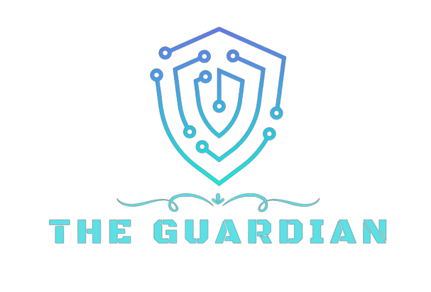

<!-- PROJECT LOGO -->
 

    
   

 

<!-- ABOUT THE PROJECT -->

### About The Project 👨‍👩‍👧

The client side is built using React.js and was fully desinged by us. (Myself and my collaborator Idan Cohen Zada). It consists of a grand Homepage, a Login page, statistics page which reflects the major vulnerabilities our system inferred from the user's Instagram's account and later directs the user to focused results: compromised locations. Close cycle of friends and family. Patterns, lables and categories that the user might be closely involved with such as: a smoker, nature lover, musician, extolling army service etc.

 

---

 

### Sneak Peek Images and Videos 🔎:

 

https://github.com/RoiYehezkel/The-Guardian/assets/88332335/d3cf546d-dc50-4f82-9c45-2030bf258523

 

---

 

### Features Included 🚀:

- Full integration with the Instagram Basic Display API.
- Creating a MongoDB schema with Mongoose framework.
- Third-party library 'axios' to make HTTP/HTTPS requests from the frontend to the backend.

 

---

 
